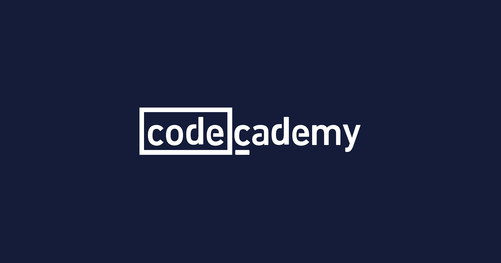

# Codecademy

> Tracking my learning journey on Codecademy — **C**, **Bash**, and **applied cybersecurity**. This repo gathers exercises, mini‑projects, and notes as I move through relevant Codecademy paths.

## Focus

C · Bash · Unix fundamentals · systems programming basics · security‑minded practices.

## Contents (no strict order)

* **C Fundamentals** — types, control flow, functions.
* **Pointers & Memory** — arrays, pointer arithmetic, dynamic allocation.
* **Strings & I/O** — safe string handling, files, CLI args.
* **Data Structures & Algorithms** — lists, stacks/queues, sorting/search.
* **File I/O & Parsing** — scanners, simple formats, error handling.
* **Bash Basics** — variables, conditionals, loops, functions.
* **Text Processing** — `grep`, `sed`, `awk`, `cut`, `sort`, `xargs`.
* **Processes & Pipelines** — redirection, pipes, job control.
* **Linux Permissions** — users/groups, `chmod`, `umask`.
* **Networking Basics** — sockets at a high level, `curl`, HTTP basics.
* **Debugging & Tooling** — `gdb`, `valgrind`, sanitizers (when applicable).
* **Security Basics** — input validation, bounds checks, least privilege.
* **Mini‑tools** — small utilities that turn lessons into practice.

## Goals

* Build strong foundations in C and Bash with clean, readable code.
* Practice secure coding habits and careful error handling.
* Turn lessons into small, reusable tools and concise write‑ups.
* Document progress clearly and iterate with feedback.

## Approach

* **Style**: C99 with `-Wall -Wextra -Werror`; small functions; explicit returns.
* **Safety**: prefer bounded ops; check every return value; guard against UB.
* **Quality**: add examples/tests where useful; use `gdb`/`valgrind` for non‑trivial C.
* **Ethics**: share original solutions and insights; avoid posting paid content verbatim.

## About Codecademy

**Codecademy** offers interactive programming courses and projects. I'm using it as a structured guide while building extra practice and tools here. (See codecademy.com for more.)

## License & Policy

All work here is for **educational purposes** under the **MIT License** (unless noted). Please respect platform terms and avoid copying proprietary course material; use this repo for reference and inspiration only.

---

*Author: Diogo Serra — focusing on C, Bash, and applied cybersecurity.*
